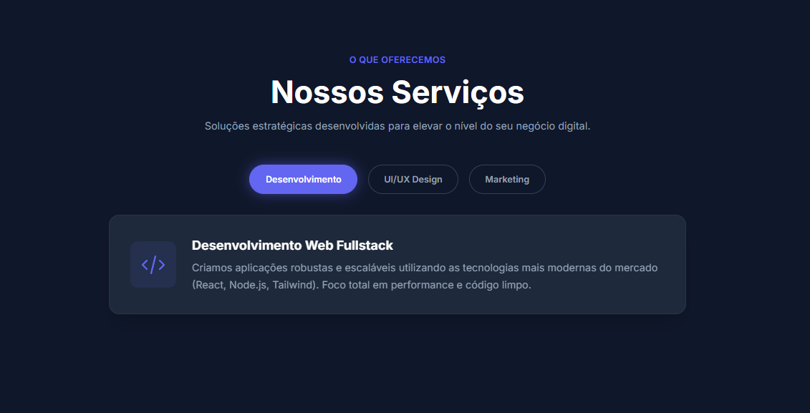

# 🚀 Service Tabs UI

> Um componente de interface interativo, responsivo e moderno desenvolvido para demonstrar manipulação de DOM e estilização com Tailwind CSS.




## 💡 Sobre o Projeto

Este projeto consiste em um sistema de abas (Tabs) para navegação de conteúdo sem recarregamento de página. O foco principal foi criar uma experiência de usuário fluida (UX) com feedback visual claro e animações suaves.

## 🛠️ Tecnologias e Decisões Técnicas

* **HTML5 Semântico:** Estrutura acessível e organizada.
* **Tailwind CSS (CDN):** Escolhido para prototipagem rápida e estilização utilitária diretamente no markup.
    * *Configuração Custom:* O tema foi estendido via script para incluir cores da marca e animações personalizadas (`fade-in`).
* **JavaScript (ES6+):** Lógica separada em módulos (`assets/js`) para manutenibilidade.
    * Uso de `forEach` e manipulação de classes (`classList`) para controle de estado.
    * Técnica de *Reflow Hack* para reiniciar animações CSS via JS.

## 📂 Estrutura de Arquivos

A estrutura foi pensada para projetos estáticos, mantendo a raiz limpa e os recursos organizados:

/sistema_tabs

    │
    ├── assets/              <-- Pasta principal de recursos
    │   ├── js/              <-- Pasta específica para Scripts
    │   │   └── script.js
    │   │
    │   │
    │   └── img/ 
    |        └── image.png     
    │
    ├── index.html           
    └── README.md            <-- Documentação

## ✨ Funcionalidades

- [x] **Navegação por Abas:** Alternância de conteúdo sem refresh.
- [x] **Estado Ativo/Inativo:** Feedback visual imediato no botão selecionado (Sombra e Contraste).
- [x] **Animações:** Transição suave (`fade-in`) ao trocar de conteúdo.
- [x] **Responsividade:** Layout adaptável para mobile e desktop.

## 🚀 Como executar

1. Clone este repositório:
   ```bash
   git clone [https://github.com/Alicia-Alexia/sistema_tabs.git]

2. Abra o arquivo index.html em qualquer navegador.